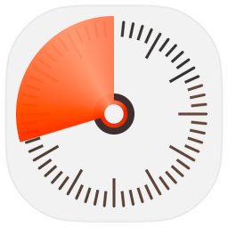

# Timer
Simple [Alfred](https://www.alfredapp.com/) workflow for setting up short timers with a few keystrokes.

## Usage
Use keyword `timer` (or custom keyword) to init Timer. Hit ↵ to set up Timer to default duration (configurable) or pass duration as an argument. Specify timer message. Timer is set!

Set up two presets for your custom time durations.

Use keyword `pomodoro` (or custom keyword) to start pomodoro timer which has customizable duration from 15 to 30 minutes.

Use `timers` (or custom keyword) to see the list of active timers with option to cancel individual timers.

### Duration input examples
- 10 mins 10
- 1 hour 20 minutes
- 35s
- 50 seconds
- 1h 30.5m
- .5m

### Duration input formats
Hours – h, hr, hrs, hour, hours.  
Minutes – m, min, mins, minute, minutes.  
Seconds – s, sec, secs, second, seconds.

If no time unit is provided, it is counted as seconds.

